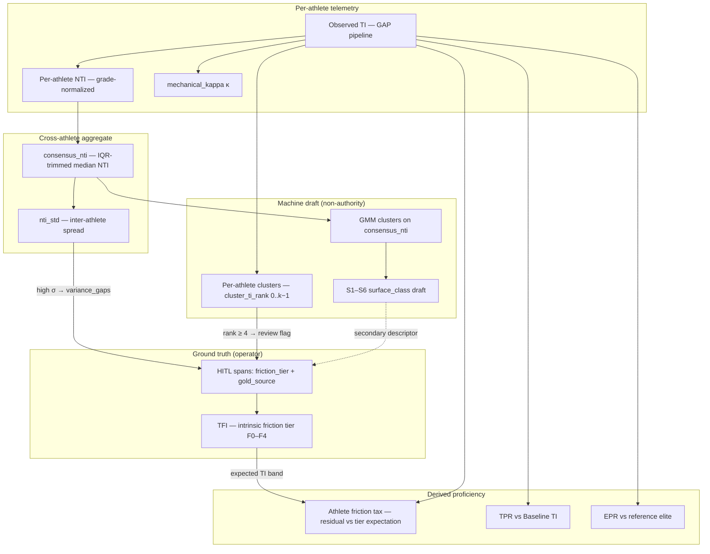

# Friction Index Specification

**Laboratory:** The Anatomy of Pace · **Authority:** Dr. Anatomy Pace  
**Status:** Public research specification · **Version:** `friction_index_v0`  
**Corridor pilot:** `gramstad_band` on SUT_43 (course km 29–41)  
**Related:** `docs/theory.md` §5 · `docs/master_plan.md` §2–4 · `04_Python_Scripts/spatial/surface_ontology.py`

---

## 1. Purpose & scope

The Friction Index programme separates **intrinsic course friction** from **athlete-specific performance mixing** (terrain × skill × state). The laboratory treats friction as the primary quantity for corridor ground truth, pacing budgets, and Baseline TI calibration. Surface vocabulary (asphalt, bog, chunky gravel) is descriptive metadata — not the authority axis.

### Pilot corridor

| Field | Value |
|-------|-------|
| Sector | `gramstad_band` |
| Race | `SUT_43` |
| Course km | 29.0–41.0 |
| Registry | `config/race_corridors.json` → `gramstad_band_ontology` |
| Terrain map | `config/spatial_terrain_map_sut43.json` |
| Sector lock | `2026-06-26-sut43-gramstad-band` (`03_Processed_Data/spatial/sut43_terrain_ontology/align_meta.json`) |

The gramstad_band window is the Phase A–D stress-test corridor: late-loop traverse (Revhol → Bjørndalsfjellet → Gramstad) through mixed runnable and technical tread. Operator HITL on this band establishes friction-tier gold before ML-assisted expansion to other SUT_43 sectors and SUT_160 segments outside the overlap.

### Friction-primary vs S1–S6 surface labels

| Layer | Role | Authority |
|-------|------|-----------|
| **Friction tier (F0–F4)** | Intrinsic mechanical + cognitive resistance of the course metre | Operator HITL gold (`friction_tier`) |
| **S1–S6 surface class** | Descriptive ontology for clustering stress tests and ML drafts | Secondary; maps many-to-one onto friction tiers |
| **GMM / GBM draft** | Proposes S-class from `consensus_nti` or kinematic features | **Not** friction authority — review hint only |

S1–S6 (`surface_ontology.py`, `s6_v0`) was designed as a six-class simplification for GMM/K-means on aggregated NTI. It collapses the eleven-class master-plan terrain scale into bands aligned to TI targets. That design is useful for draft clustering and dashboard overlays, but it conflates **surface appearance** with **friction magnitude**. Example: chunky tractor gravel may present as “gravel” (S2 vocabulary) while carrying F3 friction (high mechanical tax); easy hard-pack road may be S2 at F1. The Friction Index spec elevates tier labels above S-class for ground truth and success metrics.

---

## 2. Definitions

### Terrain Friction Index (TFI)

**TFI** is the intrinsic course property: expected Terrain Index (TI) for a reference-skilled athlete on that metre, after grade is handled by the GAP pipeline.

| Property | Detail |
|----------|--------|
| Nature | Target ground truth — not directly observed in a single `.fit` file |
| Units | TI-equivalent ratio (same scale as observed TI: 1.0 = neutral asphalt-equivalent) |
| Estimation | Operator friction tier → tier midpoint or band; refined by cross-athlete `consensus_nti` and reference-elite Baseline TI in Phase C/D |
| Distinction from Baseline TI | Baseline TI is the løype-level matrix abstracted from reference elites; TFI is the per-metre friction ground truth that Baseline TI aggregates toward |

TFI answers: *how much does this course metre slow a competent reference runner beyond what grade alone predicts?*

### Observed TI

Per-athlete, per-metre performance index from the GAP pipeline.

| | |
|---|---|
| **Formula** | TI = v_actual / v_GAP (equivalent: pace_actual / pace_GAP) |
| **Smoothing** | 30 s rolling mean |
| **Filter** | Iso-HR (aerobic zone) where appropriate for APR-adjacent work |
| **Code** | `11_gap_engine.py`; aligned panel `panel_1m.parquet` |
| **Mixing** | Observed TI = f(TFI, athlete skill, fatigue, state, GPS noise) |

Observed TI is the measured quantity. It must not be mistaken for intrinsic friction.

**Telemetry non-identifiability:** A single friction tier or S-class does not map one-to-one to a unique TI/speed signature. Grade, run-vs-walk locomotion, tactical iso-HR effort, and fatigue can produce overlapping observed TI on the same tread — especially S3–S6 and F2–F4. Operator tier gold remains ontological authority; cross-athlete `consensus_nti` corroborates but does not replace HITL on technical trail metres.

### consensus_nti

Cross-athlete aggregate at each course metre — partial de-mixing of grade and inter-athlete spread.

| | |
|---|---|
| **Per-athlete NTI** | NTI ≈ TI / median(TI \| grade bin); grade-bin median subtraction (`terrain_map_gen.compute_nti`) |
| **consensus_nti** | IQR-trimmed median of per-athlete NTI at each `course_m`; emits `nti_std` on trimmed set |
| **nti_median** | Simple median of TI (or NTI) across athletes — used for HITL consistency checks (`hitl_nti_consistency.py`) |
| **Role** | Clustering feature for GMM draft (`feature_col: consensus_nti`); diagnostic for tier validation |

`consensus_nti` removes outlier athletes and normalizes grade locally, but **does not** fully isolate skill. Two athletes with different technical proficiency on the same F3 metre will still inflate `nti_std`. High `nti_std` spans are deferred in HITL (`hitl.variance_gaps[]`).

### Athlete friction tax

Residual friction attributed to the athlete rather than the course.

| | |
|---|---|
| **Concept** | Observed TI (or NTI) minus expected TI for reference skill at the locked friction tier |
| **Interim** | ΔTI = TI_athlete − median(TI \| same `friction_tier`, grade bin) |
| **Proficiency link** | TPR = athlete TI / Baseline TI; EPR = athlete TI / elite TI on paired segment |
| **Use** | Identifies who is paying excess terrain tax vs who is extracting free speed on technical tread |

Athlete friction tax is the lever for the Effort Paradox (H1): stable HR with collapsing speed on high-friction metres implies the athlete is absorbing tax that a more efficient mover would shed.

### mechanical_kappa (κ)

Mechanical braking proxy — grade magnitude × residual TI above unity.

```
κ = |grade_pct| / 100 × max(TI − 1, 0)
```

Scaffold in `spatial_align.compute_mechanical_kappa` uses Minetti TI residual; full ceGAP-aware κ deferred to Phase B. κ is a kinematic feature for clustering pilots, not a friction-tier authority.

---

## 3. Friction tiers (F0–F4)

Five tiers name **friction magnitude** and **runnability**. Surface examples are illustrative — tier assignment is by expected TI band and field runnability, not vocabulary alone.

| Tier | Name | Expected TI band | Runnable? | Technical? | Example surfaces (non-exhaustive) |
|------|------|------------------|-----------|------------|-------------------------------------|
| **F0** | Neutral | 0.85–1.15 | Full run | No | Sealed asphalt, smooth pavement |
| **F1** | Low | 0.90–1.20 | Full run | Low | Hard-pack gravel road, compacted forest road, fine rolled gravel |
| **F2** | Moderate | 1.05–1.45 | Full run | Low–moderate | Compacted dirt tread, grass/lyng, dry slab with ankle stabilisation tax |
| **F3** | High | 1.40–1.80 | Run with care | Yes | Chunky gravel, rooty trail, coarse stone tread, exposed bedrock steps |
| **F4** | Severe | 1.80–4.50 | Walk / scramble | Yes | Loose scree, deep bog, coarse ur, vacuum mud |

**Runnable vs technical:** Runnable tiers (F0–F2) permit continuous running rhythm at race effort. F3 is technical-runnable: running continues but stride frequency and line choice dominate. F4 is severe: runnability collapses; pace is dominated by footing negotiation or extraction cost (Pinnington sand analogue; master-plan classes 7, 10–11).

Tier bands intentionally overlap at boundaries (F1/F2, F2/F3, F3/F4) because friction is continuous; operator HITL picks the tier whose band best matches field truth and cross-athlete TI centre.

---

## 4. Mapping to S1–S6

Many-to-one and one-to-many. S-class is **not** sufficient to recover friction tier.

| S-class | S label (ontology) | TI target / band (`surface_ontology.py`) | Typical friction tier(s) | Notes |
|---------|-------------------|-------------------------------------------|--------------------------|-------|
| **S1** | Asphalt | 1.0 · (0.85, 1.15) | **F0** | Near-locked when GPS and sector QC agree |
| **S2** | Gravel | 1.0 · (0.90, 1.20) | **F1**, **F2**, **F3** | Wide friction spread — easy hard-pack → F1; chunky gravel → **F3**, not F1 |
| **S3** | Grass or hard dirt | 1.25 · (1.05, 1.45) | **F2**, **F3** | Easy dirt tread → F2; vegetated stabilisation tax → F2–F3 |
| **S4** | Technical rock (medium) | 1.6 · (1.40, 1.80) | **F3** | Primary home for technical-runnable rock |
| **S5** | Technical rock (difficult) | 2.2 · (1.80, 2.60) | **F4**, **F3** | Loose mass upper F3 if still runnable; else F4 |
| **S6** | Bog (wet mud) | 2.5 · (2.00, 4.50) | **F4** | Severe / non-runnable |

**Examples from gramstad_band HITL:**

- Easy compacted dirt upstream → S3 + **F2** (not S2/F1 hard-pack override reserved downstream).
- Technical rock and bedrock steps km 31–33.2 → S4 + **F3**.
- Bog pockets in mixed window → S6 + **F4**; GMM draft may propose S6 where operator confirms mud only.

---

## 5. Relationship diagram



**Reading the diagram:** Operator friction tier (TFI) is upstream of all ML drafts. `consensus_nti` and per-athlete clusters inform review; they do not override TFI. Athlete friction tax and TPR/EPR sit downstream of observed TI once tier expectations are locked.

---

## 6. HITL recording

### Primary and secondary fields

| Priority | Field | Values | Role |
|----------|-------|--------|------|
| **Primary** | `friction_tier` | `F0` … `F4` | Operator gold — intrinsic friction authority |
| **Secondary** | `surface_class` | `S1` … `S6` | Descriptive ontology; optional on same span |
| **Provenance** | `gold_source` | `operator` (default), `consensus` (Phase D only, with QC) | Agreement tier promotion |
| **Audit** | `reason` | Free text | Course-direction notes; tier rationale |

**Explicit rule:** ML surface class (GMM draft, gradient-boosting prediction, `cluster_to_surface_class` mapping) is **never** friction authority. It may appear as dashboard overlay or `accept_draft_classes` policy — not as `friction_tier` without operator assignment.

### JSON span schema extension

Extend `hitl.manual_overrides[]`, `hitl.operator_gold_spans[]`, and future `hitl.friction_spans[]` in `config/spatial_terrain_map_sut43.json`. Proposed fields (additive to `config/spatial_terrain_map.schema.json`):

```json
{
  "course_km_start": 31.0,
  "course_km_end": 33.2,
  "friction_tier": "F3",
  "surface_class": "S4",
  "gold_source": "operator",
  "mode": "lock",
  "reason": "Technical bedrock tread — high friction runnable; tier F3 per friction_index_spec; S4 descriptive secondary."
}
```

| Field | Required | Notes |
|-------|----------|-------|
| `course_km_start`, `course_km_end` | Yes | Course km, start → finish |
| `friction_tier` | Yes for friction gold | `F0`–`F4` |
| `gold_source` | Yes for gold promotion | `operator` until Phase D consensus protocol |
| `reason` | Recommended | Clinical audit trail |
| `surface_class` | Optional | Secondary S1–S6 |
| `mode` | For overrides | `guidance` (overlay) or `lock` (effective segment) |

Friction spans may live in a dedicated `hitl.friction_spans[]` array to avoid conflating tier locks with legacy S-class-only overrides during migration.

### Workflow

1. **Sector-first** — Complete `gramstad_band` (km 29–41) before adjacent sectors. Bump `sector_lock_version` on promotion per `docs/corridor_lock_policy.md`.
2. **Chunked review** — Validation dashboard decision mode; ~2 km review chunks on long bands (`--chunk-km 2`).
3. **Cluster R4–R5 flags** — Per-athlete FIT kinematic clusters (`fit_ti_cluster_pilot.py`) emit `cluster_ti_rank` 0…k−1 sorted by mean TI. Ranks **≥ 4** (default `high_ti_rank_threshold: 4`) flag metres for friction review — high-TI kinematic segments where operator tier assignment is required. These flags are review queue, not auto-tier.
4. **S1 easy lock** — F0 spans with sealed road/asphalt, low `nti_std`, and sector QC sign-off may be locked immediately (`mode: lock`, `friction_tier: F0`). S1 surface_class may accompany but does not replace F0.
5. **Variance deferral** — Spans in `hitl.variance_gaps[]` (elevated `nti_std`) defer friction lock until second-athlete agreement or GPS revisit; guidance-only overlays permitted.
6. **Promotion path** — `guidance` → field/GPS QC → `lock` → optional `operator_gold_spans[]` for ML training tiers.

### What HITL does not do

- Promote GMM cluster ID or GBM predicted class to `friction_tier` without operator entry.
- Use `accept_draft_classes` alone as friction gold — that policy preserves S-class draft only.
- Lock friction on metres with unresolved cross-athlete σ without `defer_reason` documentation.

---

## 7. Decomposition roadmap (Phase C / D)

Goal: isolate **skill** vs **terrain** after friction-tier gold stabilizes on gramstad_band.

| Step | Method | Output |
|------|--------|--------|
| **C1 — Iso-HR APR** | APR = pace_segment / pace_asphalt_anchor @ matched HR | Effort-locked pace comparison including grade + friction + technique (`02_terrengindeks.py` interim) |
| **C2 — Reference elite Baseline TI** | Aggregate TI from Reference_Elite_* on locked tiers | Per-tier expected TI; Baseline TI matrix for TPR |
| **C3 — Two-athlete spread** | Subject_A vs Subject_B ΔTI on same `friction_tier` spans with low `nti_std` | Skill residual vs terrain residual; EPR / EAR on paired segments |
| **C4 — TFI refinement** | Regress `consensus_nti` onto locked F-tier dummies + grade features | Empirical TFI centroids per tier; update tier band tables |
| **D1 — SUT_160 generalization** | ML draft + chunked HITL on segments outside SUT_43 overlap | Friction tier propagation without metre-by-metre hand labelling |

**Effort Paradox check:** On F3/F4 spans, iso-HR APR rising while observed speed falls implicates athlete friction tax or cumulative debt (H2) rather than mis-tiered TFI.

---

## 8. Success metrics

Metrics align with friction ground truth — not ML surface-class leaderboard scores.

| Metric | Definition | Target direction |
|--------|------------|------------------|
| **Sector lock %** | Metres with `mode: lock` on `friction_tier` / total sector metres | ↑ toward ≥ 80% on gramstad_band before Phase C expansion |
| **Mean TI within tier band** | \|median(TI \| tier) − tier band centre\| per locked span | ↓; flagged when median TI outside tier band for locked spans |
| **Inter-athlete TFI agreement** | Median `nti_std` on locked tier spans; % metres below σ threshold | ↓ σ on F0–F2; document σ on F3–F4 |
| **HITL–NTI consistency** | `hitl_nti_consistency.json` tier vs TI band pass rate | ↑ pass rate on locked spans |
| **Gold tier density** | % operator gold metres (`gold_source: operator`) | ~50% gold tier on labelled metres (Phase A target) |

**Not a success metric:** LOOCV macro-F1 on four-class (or six-class) GBM surface predictor — e.g. holding out S4 and scoring multiclass F1 (`terrain_gb_sut43_loocv_diagnostics_baseline.json`). That score optimizes S-label memorization, not friction fidelity. GBM LOOCV may be retained as a **diagnostic ablation**, not a programme KPI.

---

## 9. Non-goals

| Non-goal | Rationale |
|----------|-----------|
| **Four-class GBM surface predictor as primary deliverable** | S-class collapse loses F1 vs F3 distinction inside S2; model chases label noise |
| **Autonomous friction tier from ML** | Operator gold remains authority through Phase D |
| **Friction tier from GMM centroids alone** | Clusters reflect `consensus_nti` mixtures, not field runnability |
| **Compass / screen-axis QC vocabulary** | Course-direction terms only (`docs/course_traversal_terminology.md`) |
| **Replacing TI / Baseline TI / TPR / EPR** | Friction tiers ground-truth the inputs to those metrics, not replace them |

---

## 10. Implementation references

| Artifact | Path |
|----------|------|
| S-class ontology + TI bands | `04_Python_Scripts/spatial/surface_ontology.py` |
| `consensus_nti` computation | `04_Python_Scripts/spatial/terrain_map_gen.py` |
| Terrain map + HITL block | `config/spatial_terrain_map_sut43.json` |
| JSON schema | `config/spatial_terrain_map.schema.json` |
| HITL NTI consistency | `04_Python_Scripts/spatial/hitl_nti_consistency.py` |
| Baseline TI builder (C2) | `04_Python_Scripts/spatial/build_baseline_ti.py` |
| Validation dashboard | `04_Python_Scripts/spatial/validation_dashboard.py` |
| HITL dashboard runbook | `docs/hitl_dashboard_runbook.md` |
| GBM pilot (diagnostic) | `07_ML_Models/train_terrain_gb.py` |
| Training Residual Framework (TRF) | `docs/training_residual_framework.md` |
| Dossier geographic crosswalk (sector names only; not F-tier authority) | `config/race_corridors.json` → `SUT_160.sub_corridors` (Gramstad sector); bridged km 29–34.2 on SUT_43 per memo 13 |

**Schema migration note:** `friction_tier` is rendered on the assigned strip in decision-mode dashboards (F-tier edge + `S#/F#` labels). Operator workflow: `docs/hitl_dashboard_runbook.md`.

---

*Document prepared by the laboratory for operator HITL and pipeline alignment. Subject_* and Reference_Elite_* identifiers only in committed artifacts.*
