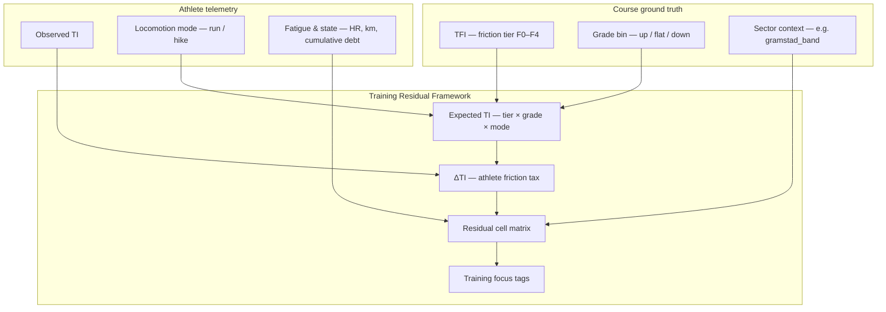

# Training Residual Framework

**Laboratory:** The Anatomy of Pace · **Authority:** Dr. Anatomy Pace  
**Status:** Public research specification · **Version:** `training_residual_v0`  
**Pilot corridor:** `gramstad_band` on SUT_43 (course km 29–41)  
**Related:** `docs/friction_index_spec.md` · `docs/theory.md` §5 · `docs/master_plan.md` §2–4 · `docs/course_traversal_terminology.md`

---

## 1. Purpose & scope

The Training Residual Framework (TRF) bridges **intrinsic course friction** (`docs/friction_index_spec.md`) and **operational session review** (`docs/theory.md` §5). It decomposes blended Terrain Index (TI) into trainable dimensions so operators can answer: *where did the athlete pay excess terrain tax, and what kind of training should address it?*

### Why GAP is insufficient on Sandnes trail

Grade-Adjusted Pace (GAP) — Minetti treadmill physics — corrects for **grade only**. It assumes a smooth, motorized belt with neutral footing. On Sandnes Ultra Trail (SUT_43, SUT_160) and comparable Rogaland courses, observed pace diverges from GAP because:

| GAP captures | GAP ignores |
|--------------|-------------|
| Metabolic cost of uphill/downhill grade | Surface friction (Pinnington sand analogue, rooty tread, bog extraction) |
| Smooth belt kinematics | Eccentric braking on technical descents (Giandolini quad-smash) |
| Steady-state treadmill effort | Cognitive line-choice tax (Millet CNS-drain on exposed / technical metres) |

When commercial platforms report "GAP pace 5:30/km" on coarse bedrock steps, the laboratory treats that figure as **grade-normalized fiction** — not a pacing authority on trail. TI isolates friction *beyond* what GAP already accounts for (`docs/theory.md` §1, §5).

### Why observed TI alone is insufficient for training focus

Observed TI is a **single blended scalar** per metre:

```
Observed TI = f(TFI, athlete skill, fatigue, state, GPS noise)
```

A session heatmap showing TI = 1.6 does not distinguish:

- Intrinsic F3 friction on a moderate downhill (course tax — train line choice and eccentric control)
- F1 friction on a steep uphill where the athlete switched to power-hike (locomotion tax — train hike economy)
- Late-race F2 flat where cumulative debt (H2) inflated TI despite unchanged tread (state tax — train fueling / CNS management)

TRF **residualizes** observed TI against locked Terrain Friction Index (TFI) expectations, then **bins** the residual across grade band, locomotion mode, and sector context. The output is a set of **training focus tags** — not a single TI number.

### Audience and use cases

| Use case | TRF role |
|----------|----------|
| Post-race review (SUT_43, SUT_160, LFI) | Rank residual cells; prioritize next mesocycle emphasis |
| Post-training session review | Compare same corridor across weeks; track tag-specific improvement |
| Kinematic_Scan / donor deliverable | Feed Tier 2 "terrain tax signature" panels (`docs/donor_pipeline_architecture.md`) |
| Operator HITL feedback | High-residual cells flag metres where friction tier or grade bin QC may need revisit |

TRF is **diagnostic**, not prescriptive coaching copy. External deliverables remain clinical ("the telemetry indicates…") per Ghost Authority protocol (`docs/brand_identity.md`).

---

## 2. Conceptual model

### Three-layer stack

| Layer | Symbol | Nature | Source |
|-------|--------|--------|--------|
| **Terrain Friction Index** | TFI | Intrinsic course property — expected TI for reference-skilled athlete after GAP | Operator `friction_tier` F0–F4; refined by `consensus_nti` in Phase C/D |
| **Observed TI** | TI | Per-athlete measured performance index | GAP pipeline (`11_gap_engine.py`); 30 s rolling mean |
| **Athlete friction tax (residual)** | ΔTI | Excess (or deficit) TI attributed to athlete vs tier expectation | TRF core output |

### Residual definition

**Interim (Phase A–C):**

```
ΔTI = TI_athlete − median(TI | same friction_tier, grade_bin, locomotion_mode)
```

Grade bins and mode filters use the same course-metre panel as TI (`panel_1m.parquet`). Where `friction_tier` is not yet locked, defer to grade × mode cohort median only and flag `residual_confidence: low`.

**Target (Phase C+):**

```
ΔTI = TI_athlete − TFI_expected(tier, grade_bin)
```

where `TFI_expected` comes from reference-elite Baseline TI centroids on locked spans (`friction_index_spec.md` §7 C2, C4).

### Proficiency ratios (context, not replacement)

| Metric | Question | TRF relationship |
|--------|----------|------------------|
| **TPR** | Is the athlete efficient vs the *course norm*? | Session-level TPR ↓ while specific ΔTI cells ↑ → localized weakness, not global inefficiency |
| **EPR** | Is the athlete efficient vs *Reference_Elite_A* on the same segment? | Paired segments validate whether residual is skill-gap or mis-tiered TFI |
| **APR** | Effort-locked pace vs asphalt anchor? | Iso-HR APR rising on F3/F4 with falling speed → Effort Paradox (H1); separates state from skill |

### Relationship diagram



**Reading the diagram:** TFI is upstream authority. ΔTI is computed only after grade and mode are aligned. Sector context and state flags prevent mis-attributing late-race collapse to technical skill gaps.

---

## 3. Decomposition axes

TRF partitions each course metre (or aggregated segment) along four orthogonal axes before matrix lookup.

### 3.1 Friction tier (F0–F4)

Primary axis from `docs/friction_index_spec.md` §3. Surface class S1–S6 is descriptive metadata only.

| Tier | Runnable? | Typical residual interpretation when ΔTI ↑ |
|------|-----------|------------------------------------------|
| **F0** | Full run | Footwear, cadence, or GPS noise — rarely primary training target |
| **F1** | Full run | Transition economy; easy-trail rhythm |
| **F2** | Full run | Ankle stabilisation; grass/lyng push-off |
| **F3** | Run with care | Line choice; root/rock foot placement; eccentric control on moderate descents |
| **F4** | Walk / scramble | Extraction strength; bog technique; accept hike-only pacing |

### 3.2 Grade band

Bins align with GAP pipeline `grade_pct` at each metre. Default boundaries (operator-tunable per corridor):

| Band | `grade_pct` range | Notes |
|------|-------------------|-------|
| **Uphill** | > +3% | Climb-specific metabolic and hike-transition tax |
| **Flat** | −3% to +3% | Isolates friction from grade; best for F1–F2 skill comparison |
| **Downhill** | < −3% | Eccentric loading; κ (mechanical_kappa) elevated when TI > 1 |

Downhill residuals on F3/F4 strongly interact with **H3 Eccentric Downfall** (`docs/master_plan.md` §3): high ΔTI late in race on moderate downhill may reflect quad damage from earlier severe descents, not current footwork.

### 3.3 Locomotion mode

Detected per metre from speed, cadence, and grade (implementation deferred — interim rules below).

| Mode | Interim detection rule | Residual use |
|------|------------------------|--------------|
| **Run** | Cadence above athlete-specific run threshold; speed above hike cutoff | Standard ΔTI |
| **Hike** | Cadence below threshold OR explicit walk on F4 | Separate cohort median — do not compare to run cohort on same tier |

**Critical rule:** Uphill power-hike on easy F1 tread produces high TI relative to *running* GAP expectation. TRF assigns mode **hike** first; residual is computed vs hike cohort, not vs run expectation. Misclassification here is the primary failure mode for "uphill power-hike on easy trail" false positives.

### 3.4 Sector context

Course-direction sector labels from corridor registry (`config/race_corridors.json`). Context modulates interpretation:

| Context flag | Trigger | Effect on tags |
|--------------|---------|----------------|
| `early_race` | Course km in first 25% of event distance | Suppress cumulative-debt tags unless ΔTI extreme |
| `late_race` | Course km in final 25% | Elevate H2 / CNS-drain tags when ΔTI broad across tiers |
| `post_eccentric` | Within N km downstream of locked F3/F4 downhill sector | Elevate eccentric-aftermath tags (H3) |
| `variance_gap` | Metre in `hitl.variance_gaps[]` | Set `residual_confidence: low`; defer training attribution |

Spatial vocabulary follows `docs/course_traversal_terminology.md` — **early/late**, **upstream/downstream** on course, never screen axes.

---

## 4. Residual cell matrix

Each cell: **TFI tier × grade band × locomotion mode** → interpretation when **ΔTI > threshold** → **training focus tag(s)**.

Default ΔTI threshold: **+0.15** above cohort median (tune per athlete baseline). Negative ΔTI (faster than expected) yields `tag: efficiency_strength` for dashboard symmetry — not a training deficit.

### 4.1 Core matrix (F1–F4)

| Tier | Grade | Mode | ΔTI ↑ interpretation | Training focus tags |
|------|-------|------|------------------------|---------------------|
| F1 | Uphill | Hike | Hike economy deficit on easy tread — excess vertical oscillation or slow transition | `uphill_power_hike_economy`, `transition_run_to_hike` |
| F1 | Uphill | Run | Climbing rhythm on runnable grade — likely aerobic, not friction | `uphill_climb_power` *(check APR before friction tag)* |
| F1 | Flat | Run | Easy-trail rhythm / cadence drift | `flat_trail_cadence`, `easy_tread_economy` |
| F1 | Downhill | Run | Unnecessary braking on easy descent | `downhill_relaxation`, `overstriding_brake` |
| F2 | Uphill | Hike | Moderate tread hike tax — pole/placement inefficiency | `uphill_power_hike_economy`, `pole_technique` |
| F2 | Flat | Run | Ankle stabilisation on grass/lyng | `ankle_stabilisation`, `push_off_stiffness` |
| F2 | Downhill | Run | Moderate eccentric load on runnable descent | `eccentric_downhill_control` |
| F3 | Uphill | Run | Technical climb foot placement | `technical_uphill_line`, `root_rock_placement` |
| F3 | Uphill | Hike | Steep technical hike — hands-on-knees efficiency | `steep_hike_technique`, `hip_hinge_hike` |
| F3 | Flat | Run | High cognitive friction — line indecision | `cognitive_line_choice`, `stride_frequency_technical` |
| F3 | Downhill | Run | **Primary steep technical downhill tax** — braking, line, quad load | `steep_technical_downhill`, `eccentric_downhill_control`, `defensive_stride_ratio` |
| F3 | Downhill | Hike | Controlled technical descent on foot | `technical_descent_hike`, `steep_technical_downhill` |
| F4 | Any | Hike | Extraction / bog / scree — expected high TI; residual vs F4 hike cohort | `bog_extraction`, `scree_balance`, `accept_hike_pacing` |
| F4 | Any | Run | Attempting run where tier expects hike — form breakdown | `runnability_discipline`, `hike_transition_timing` |

### 4.2 F0 reference row

F0 spans are calibration anchors. Persistent ΔTI ↑ on F0 suggests GPS misalignment, barometric lag, or iso-HR filter leakage — **not** a training focus. Tag: `qc_review` only.

### 4.3 State overlay tags (orthogonal to matrix)

Applied when sector context or session-level signals trigger — **stacked** on cell tags:

| Signal | Condition | Overlay tag |
|--------|-----------|-------------|
| Effort Paradox (H1) | Iso-HR APR ↑ while speed ↓ on same cell | `effort_paradox_check` — distinguish state vs skill |
| Cumulative debt (H2) | ΔTI ↑ across multiple tiers late race; HR stable | `cns_fatigue_management`, `fueling_timing` |
| Eccentric aftermath (H3) | ΔTI ↑ on flat/mild down after severe descent sector | `quad_recovery_protocol`, `eccentric_aftermath` |
| Tier QC doubt | `nti_std` elevated or metre in `variance_gaps` | `residual_confidence_low` |

### 4.4 JSON cell record (proposed)

Aggregated segment output for session review dashboards:

```json
{
  "segment_id": "sut43_gramstad_f3_down_run_km31.0_33.2",
  "course_km_start": 31.0,
  "course_km_end": 33.2,
  "friction_tier": "F3",
  "grade_band": "downhill",
  "locomotion_mode": "run",
  "sector_id": "gramstad_band",
  "ti_mean": 1.72,
  "ti_expected": 1.48,
  "delta_ti_mean": 0.24,
  "delta_ti_pctile_session": 0.91,
  "training_focus_tags": [
    "steep_technical_downhill",
    "eccentric_downhill_control"
  ],
  "overlay_tags": [],
  "residual_confidence": "high",
  "tpr_segment": 1.08,
  "epr_vs_reference_elite_a": null
}
```

---

## 5. Worked examples (hypothetical)

All examples use clinical identifiers only. Values are illustrative — not extracted from committed telemetry.

### Example A — Steep technical downhill (F3 · down · run)

**Setting:** Subject_A, SUT_43 training run, `gramstad_band` km 31.0–33.2, technical bedrock tread (locked F3).

| Field | Value |
|-------|-------|
| TI_mean | 1.78 |
| TFI_expected (F3 down run) | 1.52 |
| ΔTI | +0.26 |
| κ (mechanical_kappa) | Elevated |
| TPR (segment) | 1.12 — slightly worse than course norm |
| EPR vs Reference_Elite_A | 1.18 — reference extracts more speed on same metres |

**Interpretation:** Residual concentrates on F3 downhill running — not global fatigue (flat F2 ΔTI nominal). Reference elite comparison confirms skill gap on eccentric technical descent, not mis-tiered TFI.

**Training focus tags:** `steep_technical_downhill`, `eccentric_downhill_control`, `defensive_stride_ratio`

**Operator action:** Schedule repeated short F3 downhill reps on comparable tread; re-scan same corridor in 3–4 weeks for ΔTI trend on identical cell keys.

---

### Example B — Uphill power-hike on easy trail (F1 · up · hike)

**Setting:** Subject_B, SUT_43 long run, compacted forest road (F1), +8% grade, deliberate power-hike.

| Field | Value |
|-------|-------|
| TI_mean (if mis-binned as run) | 1.55 — falsely alarming |
| Locomotion mode (correct) | hike |
| TI_mean vs F1 up hike cohort | 1.38 |
| TFI_expected | 1.12 |
| ΔTI | +0.26 |
| APR @ iso-HR | Elevated vs Subject_B flat anchor — effort real, friction moderate |

**Interpretation:** Without mode split, operator would mis-attribute aerobic climb cost to "technical friction." Hike cohort residual isolates **hike economy** deficit on easy tread — vertical oscillation, slow run-to-hike transition upstream.

**Training focus tags:** `uphill_power_hike_economy`, `transition_run_to_hike`

**Operator action:** Hike-focused intervals on F1/F2 uphills; track cadence and vertical displacement proxy — not TI alone.

---

### Example C — Late-race flat collapse (F2 · flat · run) after severe descent

**Setting:** Subject_A, SUT_160 race simulation, km 145–155 flat hard-pack (F2), 140 km cumulative.

| Field | Value |
|-------|-------|
| ΔTI on F2 flat | +0.22 — session 85th percentile |
| ΔTI on F3 down (km 130–135, earlier) | +0.18 — elevated but not extreme |
| Sector context | `late_race`, `post_eccentric` |
| Iso-HR | Stable — Effort Paradox pattern |

**Interpretation:** Matrix cell alone suggests `easy_tread_economy`. Context overlay reclassifies: **H3 eccentric aftermath** + **H2 cumulative debt** dominate. Training tag priority shifts from footwork to quad resilience and fueling — not more F2 flat strides.

**Training focus tags:** `eccentric_aftermath`, `cns_fatigue_management`, `quad_recovery_protocol`

---

### Example D — Efficiency strength (negative residual)

**Setting:** Subject_B, F2 flat run segment, ΔTI = −0.12 vs cohort.

**Interpretation:** Athlete faster than tier expectation — record as `efficiency_strength` for balanced review. TRF is symmetric; donors should see strengths, not only deficits.

---

## 6. Session review workflow

Post-race and post-training review follow the same sequence. Course-direction language throughout.

```mermaid
flowchart LR
    INGEST["1. Ingest .fit → panel_1m"]
    LOCK["2. Join friction_tier + grade + mode"]
    RESID["3. Compute ΔTI per metre"]
    AGG["4. Aggregate to residual cells"]
    RANK["5. Rank cells by ΔTI × distance"]
    TAG["6. Map to training focus tags"]
    CONTEXT["7. Apply state overlays"]
    REPORT["8. Session residual report"]
    INGEST --> LOCK --> RESID --> AGG --> RANK --> TAG --> CONTEXT --> REPORT
```



### Step-by-step

| Step | Action | Gate |
|------|--------|------|
| **1. Ingest** | Snap-to-Route; GAP + TI pipeline; iso-HR filter where APR-adjacent | Privacy zones applied (`docs/master_plan.md` §7) |
| **1b. Spine (cross-athlete)** | `build_reference_spine.py` → `reproject_to_spine.py` → `panel_race_1m_spine.parquet` keyed on `ref_chainage_m` | Anchor validation 282–390 m B-vs-A stream offset at shared pins |
| **2. Join axes** | Merge `friction_tier` from terrain map; bin `grade_pct`; detect `locomotion_mode` | Unlocked tier → `residual_confidence: low` |
| **3. Residualize** | Compute ΔTI vs cohort or TFI_expected | Skip F0 except QC |
| **4. Aggregate** | Mean/max ΔTI per cell key; weight by metre count | Min 200 m per cell for tag promotion |
| **5. Rank** | Sort by `delta_ti_mean × segment_length` | Top 5 cells → primary review queue |
| **6. Tag** | Matrix lookup §4 | Multiple tags allowed |
| **7. Overlay** | H1/H2/H3 context flags | May supersede cell tags |
| **8. Report** | Export JSON + summary table; optional Kinematic_Scan Tier 2 panel | Clinical copy only externally |

### Comparison modes

| Mode | Compare | Detects |
|------|---------|---------|
| **Within-athlete temporal** | Same cell keys across sessions | Tag-specific improvement (e.g. F3 down ΔTI trend) |
| **Within-session spatial** | Rank cells in one race | Race-day priorities — where time was lost |
| **Cross-athlete paired** | Subject_A vs Subject_B on locked low-σ spans | Skill vs state (`friction_index_spec.md` §7 C3) |
| **vs Reference_Elite_A** | EPR on paired segments | Elite gap magnitude per tag |

### Decision rules for operators

1. **Never train to a single TI peak** — always resolve cell key first.
2. **Mode misclassification check** — if F1 uphill residual looks extreme, re-run with hike cohort before tagging.
3. **Defer tags on `variance_gaps`** — fix TFI or add second athlete before prescribing focus.
4. **Late-race broad ΔTI** — prefer overlay tags over footwork tags.
5. **TPR < 1.0 globally but specific ΔTI cells high** — localized curriculum; not general "inefficiency."

---

## 7. Phase roadmap

Aligned with `docs/friction_index_spec.md` §6–§7. TRF maturity depends on friction-tier gold density.

| Phase | Friction programme | TRF capability | Deliverable |
|-------|-------------------|----------------|-------------|
| **A** | gramstad_band HITL; ~50% operator gold | ΔTI vs grade × mode cohort only; manual sector tags | Spreadsheet / notebook ranking |
| **B** | Sector lock ≥ 80%; κ ceGAP-aware | Cell aggregation script; JSON cell records | `training_residual_report.json` per session |
| **C1** | Iso-HR APR integrated | Effort Paradox overlay auto-flag | H1 disambiguation in workflow step 7 |
| **C2** | Reference-elite Baseline TI on locked tiers | ΔTI vs TFI_expected; TPR/EPR per cell | Kinematic_Scan Tier 2 residual panel |
| **C3** | Two-athlete spread on low-σ spans | Cross-athlete residual validation | Confidence promotion on tags |
| **C4** | Empirical TFI centroids | Updated expected TI bands | Matrix threshold recalibration |
| **D1** | SUT_160 friction propagation | Full-course TRF on LFI / SUT_160 | Pre-race focus brief from historical cells |

**Dependency:** TRF cell keys require `friction_tier` on metres under review. Until Phase B lock density, treat outputs as **exploratory** — rank cells for HITL priority as much as for training tags.

---

## 8. Success metrics

Metrics align with friction ground truth and training-actionability — not ML surface-class scores.

| Metric | Definition | Target direction |
|--------|------------|------------------|
| **Tag stability** | Top-3 tags unchanged on same corridor across 3 consecutive sessions at similar load | ↑ — confirms signal, not noise |
| **Cell ΔTI trend** | Median ΔTI on priority cell key vs 4-week baseline | ↓ on targeted tags after intervention block |
| **Mode classification accuracy** | Manual audit sample: hike vs run on F1–F2 uphills | ↑ — critical for Example B class |
| **Residual–EPR agreement** | Cells with high ΔTI also show EPR > 1.0 vs Reference_Elite_A when paired data exist | ↑ correlation |
| **False tag rate** | Tags reversed after overlay review (H2/H3 superseded footwork) | ↓ — better context rules |
| **Tier lock coverage** | % session metres with locked `friction_tier` used in residual | ↑ with friction programme |

**Not a success metric:** LOOCV macro-F1 on GBM surface predictor (`friction_index_spec.md` §8). S-class memorization does not validate training residuals.

**Not a success metric:** Raw session mean TI — blends course and athlete without decomposition.

---

## 9. Implementation references

| Artifact | Path | TRF role |
|----------|------|----------|
| Friction tier spec | `docs/friction_index_spec.md` | TFI authority, ΔTI definition |
| Theory & metrics | `docs/theory.md` §5 | TI, TPR, EPR, APR definitions |
| GAP / TI pipeline | `04_Python_Scripts/11_gap_engine.py` | Observed TI source |
| **TRF ΔTI pipeline** | `04_Python_Scripts/spatial/compute_training_residual.py` | Metre-level ΔTI + cell JSON export |
| **Spine reprojection** | `04_Python_Scripts/spatial/reproject_to_spine.py` | `ref_chainage_m` axis for cross-athlete same-metre joins |
| **Reference spine** | `04_Python_Scripts/spatial/build_reference_spine.py` | Subject_A canonical 1 m grid (gramstad_band) |
| Locomotion classifier | `04_Python_Scripts/spatial/locomotion_mode.py` | Run / hike mode per metre |
| Terrain map + HITL | `config/spatial_terrain_map_sut43.json` | `friction_tier` join |
| NTI / consensus | `04_Python_Scripts/spatial/terrain_map_gen.py` | Cohort medians, σ gates |
| mechanical_kappa | `04_Python_Scripts/spatial/spatial_align.py` | Downhill overlay input |
| Donor Tier 2 | `docs/donor_pipeline_architecture.md` | Ascent/descent vulnerability split |
| Course vocabulary | `docs/course_traversal_terminology.md` | Sector context language |

### Follow-on implementation tasks

1. **`compute_training_residual.py`** — metre-level ΔTI, cell aggregation, JSON export per §4.4.

```bash
python3 04_Python_Scripts/spatial/compute_training_residual.py \\
    --subject Subject_A \\
    --terrain-map config/spatial_terrain_map_sut43.json \\
    --panel 03_Processed_Data/spatial/sut43_terrain_ontology/panel_1m.parquet \\
    --baseline-mode cohort_median

# Cross-athlete same-metre TRF (spine panel; joins on ref_chainage_m + subject_id):
python3 04_Python_Scripts/spatial/compute_training_residual.py \\
    --cross-athlete \\
    --panel 03_Processed_Data/spatial/sut43_terrain_ontology/panel_race_1m_spine.parquet \\
    --terrain-map config/spatial_terrain_map_sut43.json
```

**Spine axis rule:** On Subject_A race spine, `ref_chainage_m == course_km × 1000` and matches operator gold `course_km_start` / `course_km_end` without re-key. Subject_B rows share `ref_chainage_m` but retain `activity_course_km` for stream-audit. HITL friction spans join on normalized `course_km` derived from `ref_chainage_m`.
2. **Locomotion mode classifier** — cadence + grade rules; athlete-calibrated thresholds in `config/subject_kinematics.local.json` (gitignored).
3. **Dashboard panel** — top residual cells + tags in validation dashboard or Kinematic_Scan Tier 2.
4. **Schema extension** — `training_focus_tags[]` optional field on friction span records for operator annotation feedback loop.
5. **Temporal diff report** — within-athlete cell ΔTI delta across sessions on locked corridors.

---

## 10. See also

| Document | Relevance |
|----------|-----------|
| `docs/friction_index_spec.md` | TFI, F0–F4 tiers, athlete friction tax, Phase C/D decomposition |
| `docs/theory.md` §5 | TI, APR, TPR, EPR formulas; Effort Paradox (H1) |
| `docs/master_plan.md` §2–4 | Hypotheses H1–H3; terrain ontology link to tiers |
| `docs/donor_pipeline_architecture.md` | Kinematic_Scan Tier 2 terrain tax signature |
| `docs/course_traversal_terminology.md` | early/late, upstream/downstream on course |

---

*Document prepared by the laboratory for session review and training-focus attribution. Subject_* and Reference_Elite_* identifiers only in committed artifacts.*
